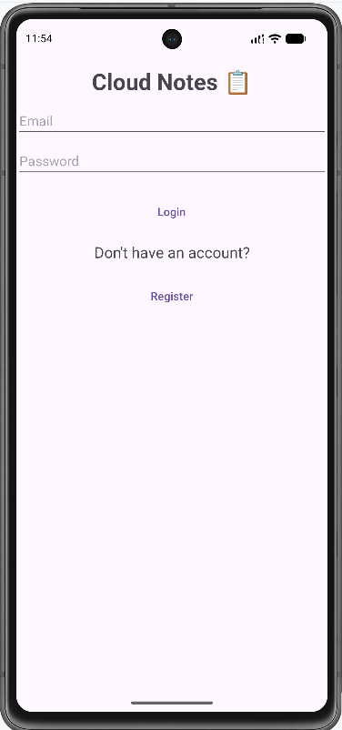
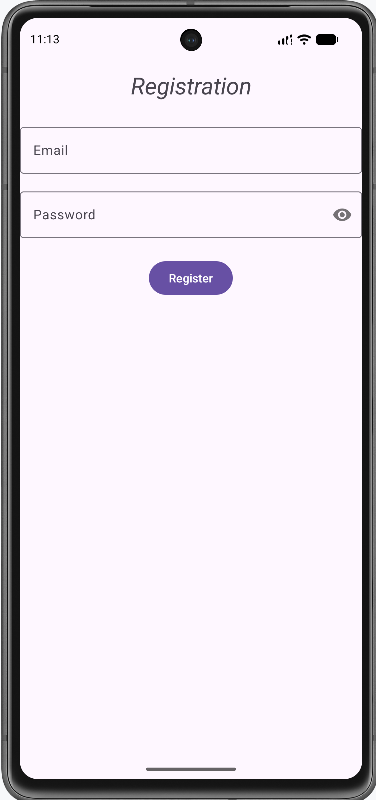
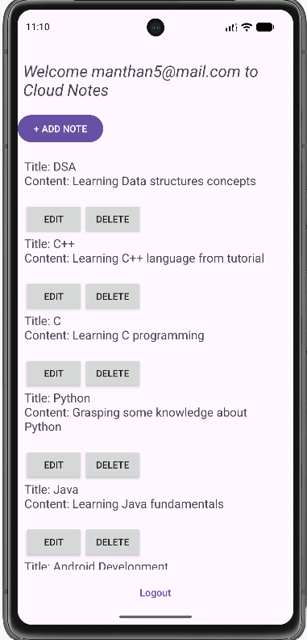
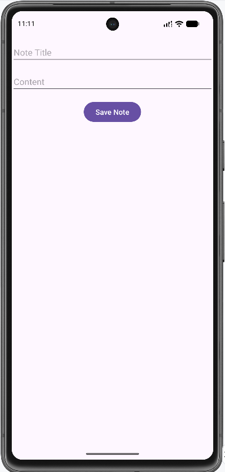
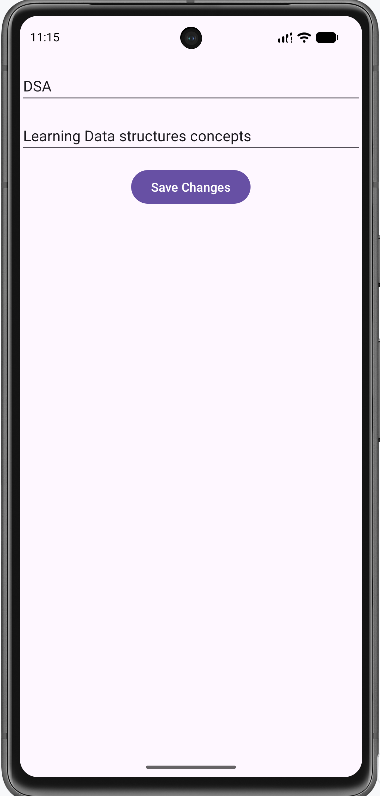

# ☁️ CloudNotes

CloudNotes is an Android note-taking application that allows users to create, edit, and manage their personal notes through a simple and user-friendly interface.

The project includes user authentication and cloud-based functionality, making it possible for users to access and manage their notes within the application.

## ✨ Features

- 🔐 User registration and login
- 📝 Create new notes
- ✏️ Edit existing notes
- 📋 View and manage notes
- 🗑️ Manage personal note data
- ☁️ Cloud-based data management
- 📱 Android-native user interface

## 🛠️ Technologies Used

- **Java** — Application development
- **Android SDK** — Android application framework
- **XML** — UI layouts and resources
- **Gradle** — Build and dependency management
- **Firebase** — Authentication and cloud services

## 📱 Application Structure

The application contains several activities responsible for different parts of the user experience:

| Activity | Purpose |
|---|---|
| `LoginActivity` | Handles user login |
| `RegisterActivity` | Handles new user registration |
| `MainActivity` | Main application screen |
| `AddNoteActivity` | Creates new notes |
| `EditNoteActivity` | Edits existing notes |

## 📂 Project Structure

CloudNotes/
├── app/
│   ├── src/
│   │   ├── main/
│   │   │   ├── java/
│   │   │   │   └── com/example/cloudnotes/
│   │   │   ├── res/
│   │   │   └── AndroidManifest.xml
│   │   └── test/
│   ├── build.gradle.kts
│   └── proguard-rules.pro
│
├── gradle/
├── build.gradle.kts
├── gradle.properties
├── gradlew
├── gradlew.bat
├── settings.gradle.kts
├── screenshots
└── .gitignore

## 🚀 Getting Started

### Prerequisites

Before running the project, make sure you have:

- Android Studio installed
- Android SDK configured
- JDK configured for Android Studio
- A connected Android device or Android Emulator

### Installation

1. Clone the repository:

   git clone https://github.com/manthanp4/CloudNotes

2. Open the project in **Android Studio**.

3. Allow Android Studio to sync the Gradle files.

4. Configure the required Firebase services for your own environment.

5. Build and run the application on an Android device or emulator.

> **Note:** `google-services.json` is intentionally excluded from this repository because the repository is public. You will need to add your own Firebase configuration file when setting up the project locally.

## 🔐 Firebase Configuration

This project uses Firebase services.

For security and repository hygiene, the project's `google-services.json` file is excluded using `.gitignore`.

To configure Firebase:

1. Create or select a project in the Firebase Console.
2. Register your Android application.
3. Download the generated `google-services.json`.
4. Place it inside:

   app/google-services.json

5. Sync and build the project in Android Studio.

Do not commit private credentials, secrets, or sensitive configuration files to a public repository.

## 🧪 Testing

The project includes Android instrumentation tests and local unit tests.

Test sources are located under:

- `app/src/androidTest/`
- `app/src/test/`

Tests can be executed through Android Studio or Gradle.

## 📸 Screenshots

Screenshots of the application will be added here.

| Login | Register |
|---|---|
|  |  |

| Notes | Add Note |
|---|---|
|  |  |

| Edit Note |
|---|

## 🎯 Project Purpose

CloudNotes was developed as an Android application project to demonstrate:

- Android application development
- User authentication
- CRUD-style note management
- Android UI development using XML
- Firebase integration
- Gradle-based Android project configuration
- Git and GitHub version control

## 🔮 Future Improvements

Potential improvements include:

- Search and filter notes
- Note categories or tags
- Rich-text note editing
- Dark mode
- Offline note access
- Improved UI/UX
- Note synchronization improvements
- Additional automated tests

## 📄 License

This project is currently available for viewing and educational purposes.

If you intend to allow others to use, modify, and distribute the project, consider adding an appropriate open-source license.

---

## 👨‍💻 Developer

**Manthan Panchal**

Android Developer

GitHub: https://github.com/manthanp4
